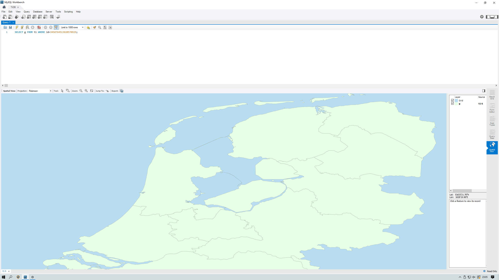

# RFC: <!-- Title --> WAY - TiDB GIS support(WIP)

<!--
This is a template for TiDB's change proposal process, documented [here](./README.md).
-->
- Team: Leonardo

Leonardo da Vinci is a versatile talent in history, in this WAY program, we would like to support spatial data in TiDB, make TiDB to support multi-model and become uniform data platform in future.
历史上的莱昂纳多.达芬奇是一个全面发展的天才，在 WAY 这个项目里，我们希望开发 TiDB 使其支持空间信息数据，扩展 TiDB 在多模数据库上的能力和应用场景，期待未来 TiDB 成为一个更加通用、完整且统一的大数据平台。

## 项目介绍 Program Intro

<!--
A short summary of the proposal:
- What is the issue that the proposal aims to solve?
- What needs to be done in this proposal?
- What is the impact of this proposal?
-->
GIS is a project to let TiDB support spatial data with a live demo.
该项目旨在使 TiDB 支持 GIS ，即地理空间位置数据。

- Author(s): [@dveeden](https://github.com/dveeden), [@madwyn](https://github.com/madwyn), [@mjonss](https://github.com/mjonss), [@yiwen92](https://github.com/yiwen92) (in alphabetical order)
- Last updated: 2022-10-10 <!-- Date -->
- Discussion at: online meetings
- Project detail: https://github.com/orgs/Hackathon-2022-GIS/repositories
- RFC at:  https://github.com/yiwen92/Hackathon2022_GIS

## 背景&动机 Background&Motivation

<!--
An introduction of the necessary background and the problem being solved by the proposed change:
- The drawback of the current feature and the corresponding use case
- The expected outcome of this proposal.
-->

GIS data is widely used in many scenarios, including supply chain, on-line service, navigation service etc, we are going to support GIS data inside TiDB to help expand more scenarios.

## 项目设计 Program Desgin

<!--
A precise statement of the proposed change:
- The new named concepts and a set of metrics to be collected in this proposal (if applicable)
- The overview of the design.
- How it works?
- What needs to be changed to implement this design?
- What may be positively influenced by the proposed change?
- What may be negatively impacted by the proposed change?
-->

Support GIS data type, support basic function, show a live demo to validate it.

User scenario: shared bike
1. input 1 location point and other shared bike points and shown in a map
2. find a shared bike nearby(within xx m)/ or find nearest one
3. input destination to get a navigation map
4. other usages of spatial(forbidden area recognition)
5. IOT extension(low battery warning, ring a bell, abnormal detection)

Main functions:
1. Define spatial data type and SQL usage in TiDB
2. Basic functions like calculate distance
3. Integration with third party tool to do navigation

Future proposal：
1. More functions, fully compatible with main usages in MySQL
2. Spatial index to accelarate search performance
3. TiDB serve as one-stop data solution with multi-model support(Document, spatial, time-series etc) to archieve more comprehensive usages

### Example

#### SQL syntax

#### Json-binary,GeoJSON

#### Visual simulator

## Rationale

<!--
A discussion of alternate approaches and the trade-offs, advantages, and disadvantages of the specified approach:
- How other systems solve the same issue?
- What other designs have been considered and what are their disadvantages?
- What is the advantage of this design compared with other designs?
- What is the disadvantage of this design?
- What is the impact of not doing this?
-->

## Compatibility and Migration Plan

<!--
A discussion of the change with regard to the compatibility issues:
- Does this proposal make TiDB not compatible with the old versions?
- Does this proposal make TiDB not compatible with TiDB tools?
    + [BR](https://github.com/pingcap/br)
    + [DM](https://github.com/pingcap/dm)
    + [Dumpling](https://github.com/pingcap/dumpling)
    + [TiCDC](https://github.com/pingcap/ticdc)
    + [TiDB Binlog](https://github.com/pingcap/tidb-binlog)
    + [TiDB Lightning](https://github.com/pingcap/tidb-lightning)
- If the existing behavior will be changed, how will we phase out the older behavior?
- Does this proposal make TiDB more compatible with MySQL?
- What is the impact(if any) on the data migration:
    + from MySQL to TiDB
    + from TiDB to MySQL
    + from old TiDB cluster to new TiDB cluster
-->

## Implementation

<!--
A detailed description for each step in the implementation:
- Does any former steps block this step?
- Who will do it?
- When to do it?
- How long it takes to accomplish it?
-->
Daniel, Mattias - Database Developer

Elwyn - Frontend Developer

Yves - Product Manager

## Testing Plan

<!--
A brief description on how the implementation will be tested. Both integration test and unit test should consider the following things:
- How to ensure that the implementation works as expected?
- How will we know nothing broke?
-->
Demo

## Open issues (if applicable)

<!--
A discussion of issues relating to this proposal for which the author does not know the solution. This section may be omitted if there are none.
-->
None
